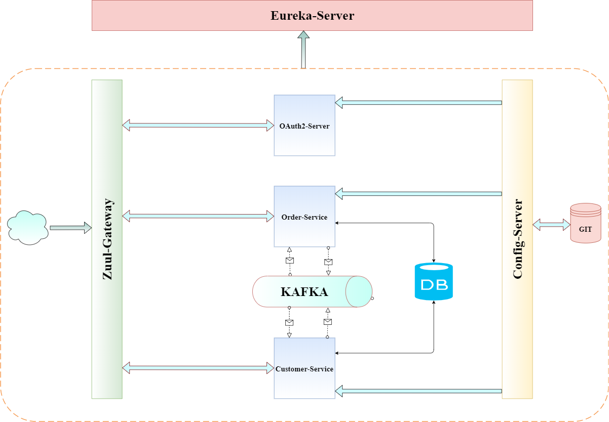
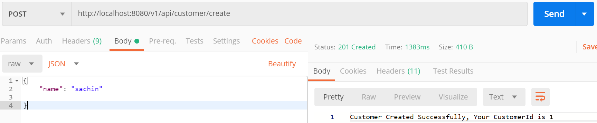
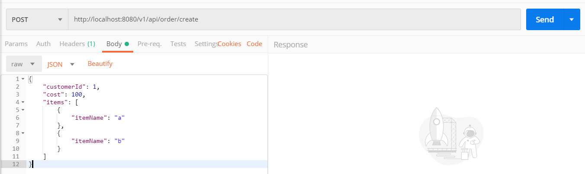
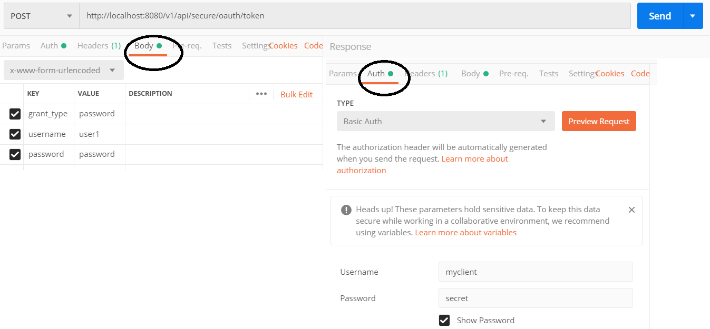
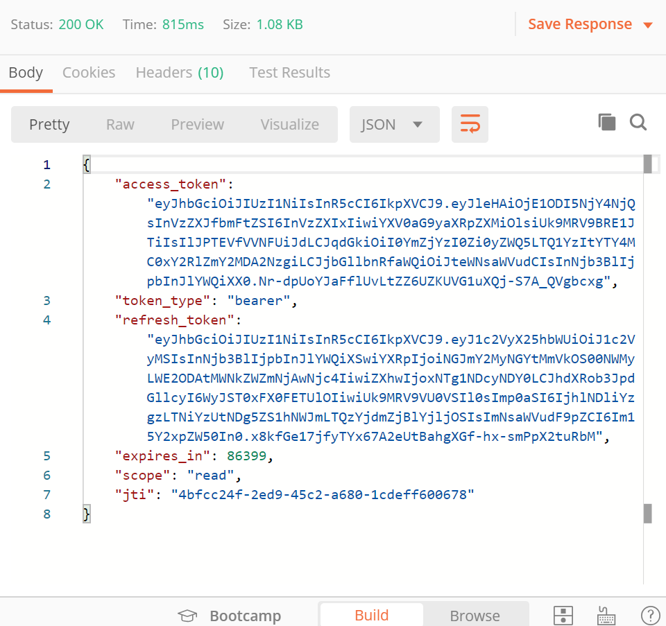
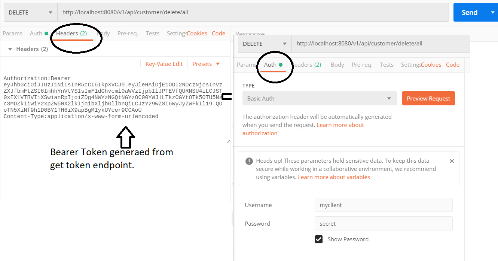

# Spring Boot MicroServices
With the help of this repository you can run microservices using Spring Boot, Spring Cloud, Spring OAuth 2 and Netflix OSS framework.

## Contributors

* [Sachin Sachdeva](https://www.linkedin.com/in/sachin-sachdeva-70896120/)

## Application Compo

The application consists of 6 different services

* [config server](config-server/README.md) 
* [eureka-server](eureka-server/README.md) 
* [oauth2-server](oauth2a-server/README.md) 
* [zuul-gateway](zuul-gateway/README.md) 
* [customer-service](customer-service/README.md) 
* [order-service](order-service/README.md) 

## Application Architecture

## Project Overview
* This project that mocks an e-commerce API where you can create a customer and orders.

* The customer can place orders having multiple products in it.

* This project uses KAFKA broker to communicate between the microservices.

## How To Run ?
* You can run the project using following steps:
    * Install latest version of **Docker**  in your machine.
    * Clone this **GIT** repository.
    * Go to directory `spring-boot-microservice` on your system.
    * Run `docker-compose up --build` and then `docker-compose up`.
 
 
## Rest End Points.

* **To create a new customer- http://localhost:8080/v1/api/customer/create** :

     
 
* **To create a new order- http://localhost:8080/v1/api/order/create** :
 
    
 
* **To get the token for secure resource- http://localhost:8080/v1/api/secure/oauth/token** :
 
    
 
* **The above end point will produce response like below** :
 
    
 

* **To access secure resource or to delete all customers- http://localhost:8080/v1/api/customer/delete/all** :
 
    
 
